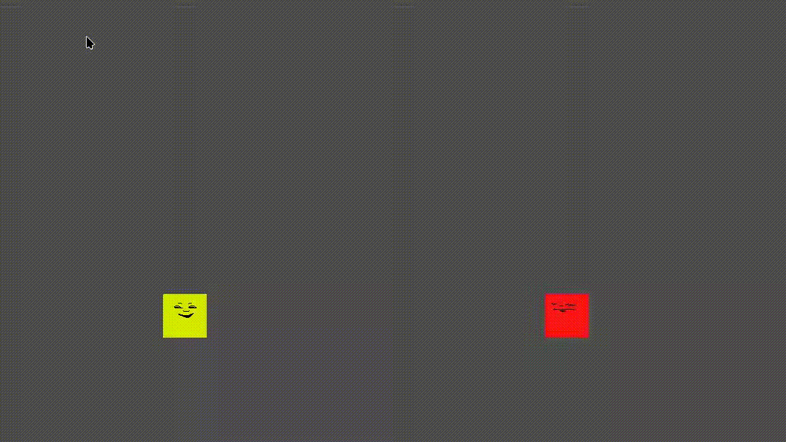

# Godot Networking Example

Goal of this example is to create two player characters where one is controlled locally and the other is controlled via a networked player connection. This should be accomplished using the High-Level Networking API within Godot so that we are not tied down to a particular network protocol.

However, since the goal is to use WebRTC networking in a browser consider setting things up to be highly compatible with that:
- Godot 4.3+ because this introduces an web export template that utilizes single-thread which is more widely accepted by browsers due to a SharedArrayBuffer exploit in the multi-threaded approach used in earlier versions.
- GodotScript Only

see: https://docs.godotengine.org/en/stable/tutorials/export/exporting_for_web.html
see: https://github.com/godotengine/godot-demo-projects
see: https://github.com/godotengine/godot-demo-projects/tree/master/networking/multiplayer_bomber

## Current Progress

- Simple Main scene
    - Camera
    - Platform for players to stand on
    - Player characters with simple sprites
    - Basic movement logic (both players move with arrow keys lol)

